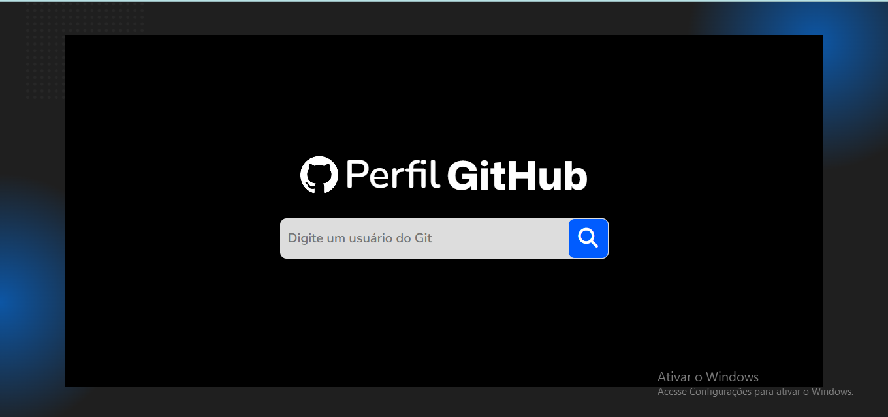
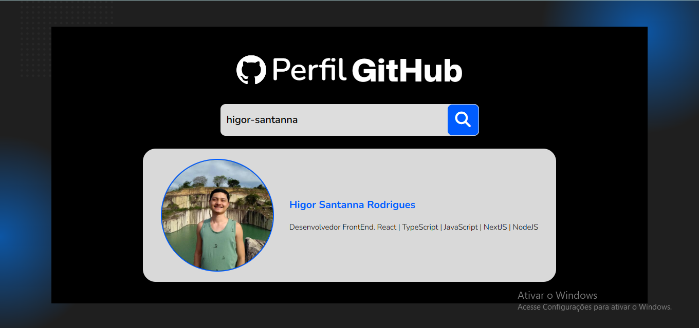
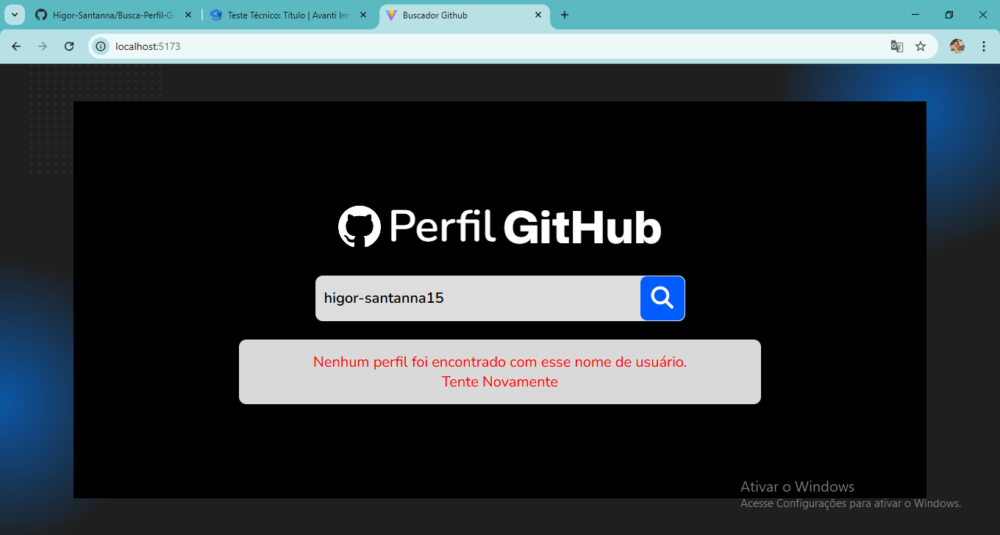
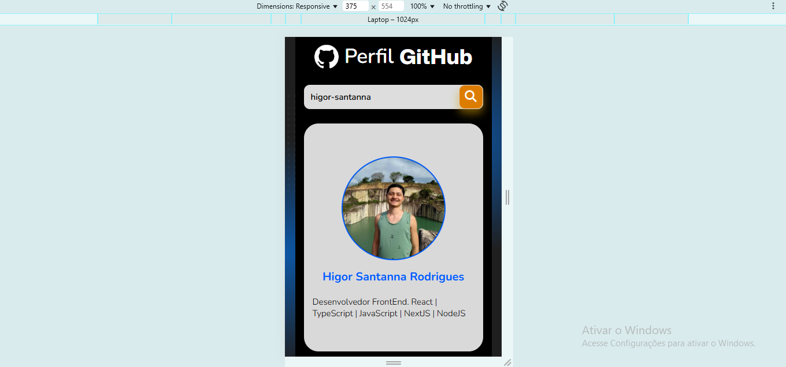

[JAVASCRIPT__BADGE]: https://img.shields.io/badge/Javascript-000?style=for-the-badge&logo=javascript
[NODE__BADGE]: https://cdn4.iconfinder.com/data/icons/logos-3/454/nodejs-new-pantone-white-512.png
[PROJECT__BADGE]: https://img.shields.io/badge/📱Visit_this_project-000?style=for-the-badge&logo=project
[PROJECT__URL]: https://github.com/Fernanda-Kipper/Readme-Templates

<h1 align="center" style="font-weight: bold;"> Busca de Perfil no GitHub 💻</h1>

<p align="center">
 <a href="#about">Sobre</a> • 
 <a href="#images">Funcionamento</a> • 
  <a href="#install">Instalação</a>
</p>

<h2 id="started">📌 Sobre</h2>

O projeto foi desenvolvido com a linguagem TypeScript com o auxílio da biblioteca ReactJs + Vite, o estilo foi feito e CSS puro. A aplicação consiste em buscar o nome, foto e descrição de algum usuário do github através do seu nickname. Isso é feito pelo campo de busca no centro da página. O projeto também conta com responsividade, o que torna muito mais agradável para usuários que utilizaram em dispositivos móveis.

<h2 id="started">📌 Funcionalidades</h2>

- Busca por usuário através do nickname;
- Caso o usuário não existe emite uma aviso;
- Verificação no campo input, caso queirá enviar uma pesquisa com o campo vazio ele retornar uma mensagem dizendo que o campo está vazio.

<h2 id="images">📍 Funcionamento</h2>

<p align="center">
    
</p>

<p align="center">
    
</p>

<p align="center">
    
</p>

<p align="center">
    
</p>


<h2 id="started">🚀 Instalação</h2>

<h3>Clonando</h3>

```bash
git clone https://github.com/Higor-Santanna/Busca-Perfil-GitHub-teste-t-cnico.git
```

<h3>Frontend</h3>

Entre na pasta, abra o terminal e digite o comando para instalar todas as dependências:

```bash
npm install
```
Para rodar a aplicação frontend, no seu terminal digite o seguinte comando e clique o link que aparecer:

```bash
npm run dev
```
OBS: Pode usar o yarn, pnpm ou o comando que você achar mais confortável.